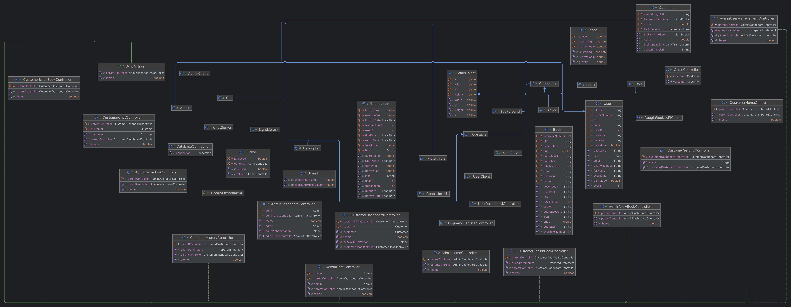
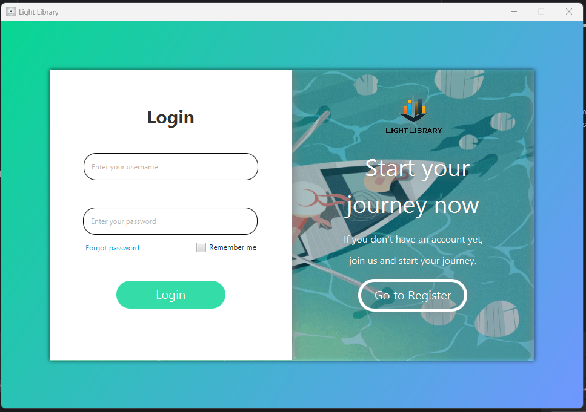
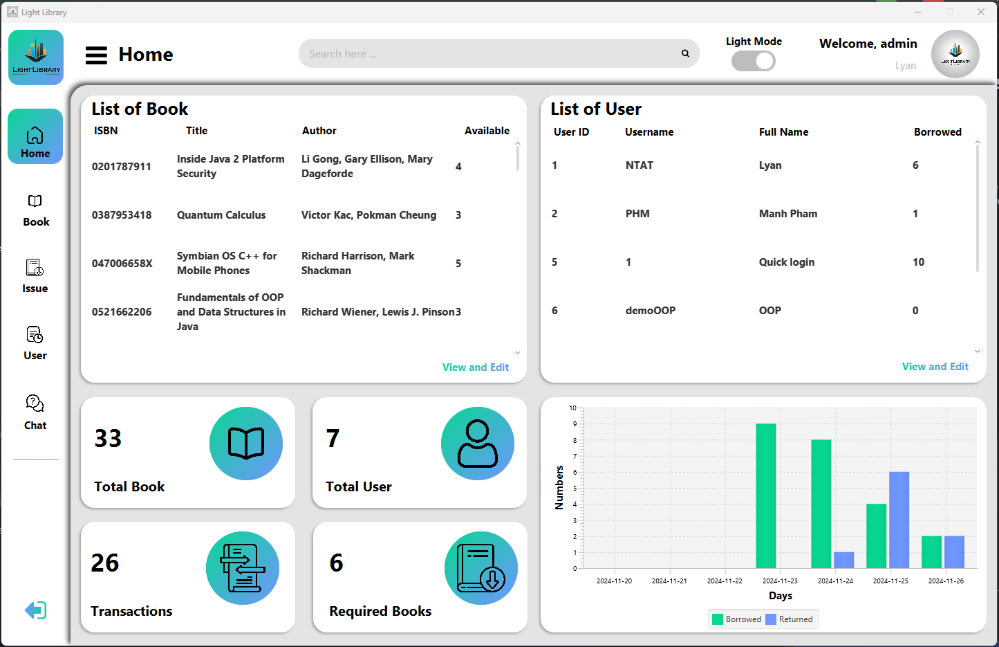
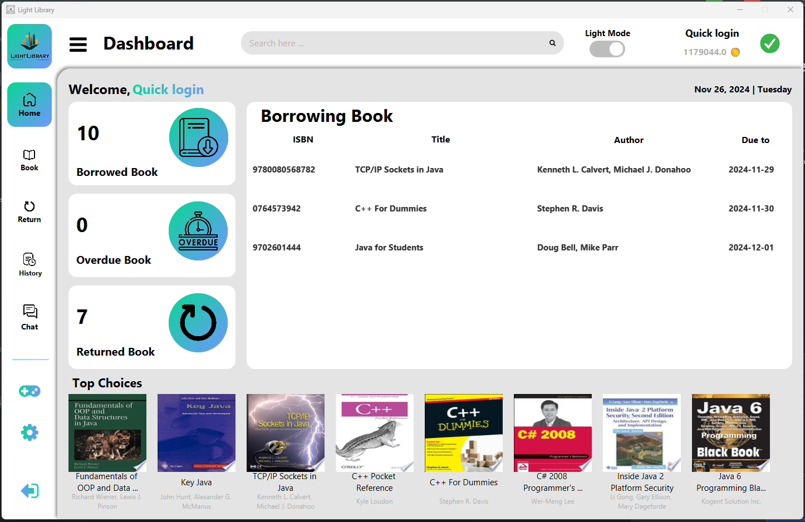
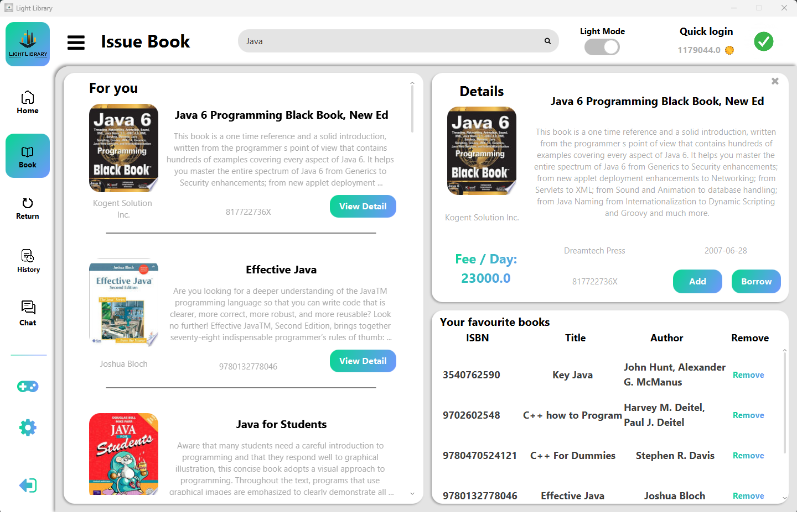
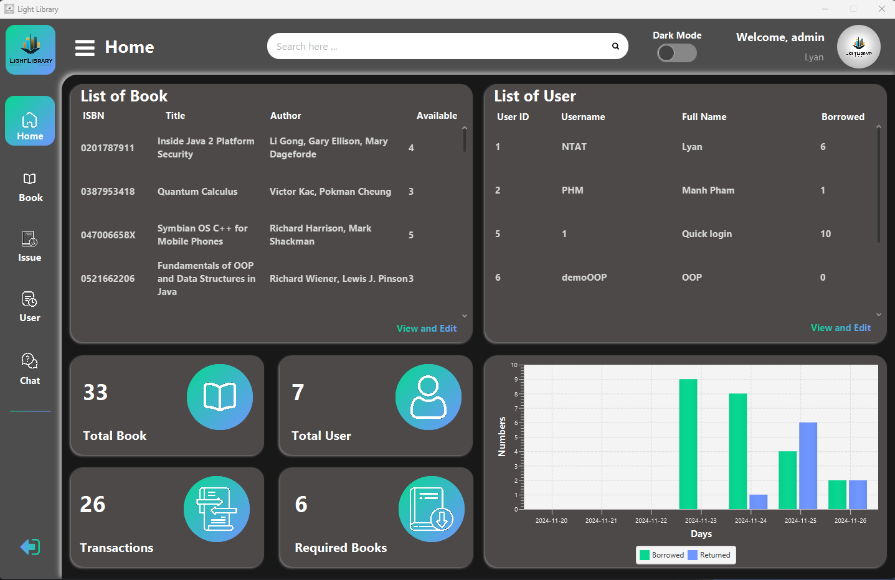
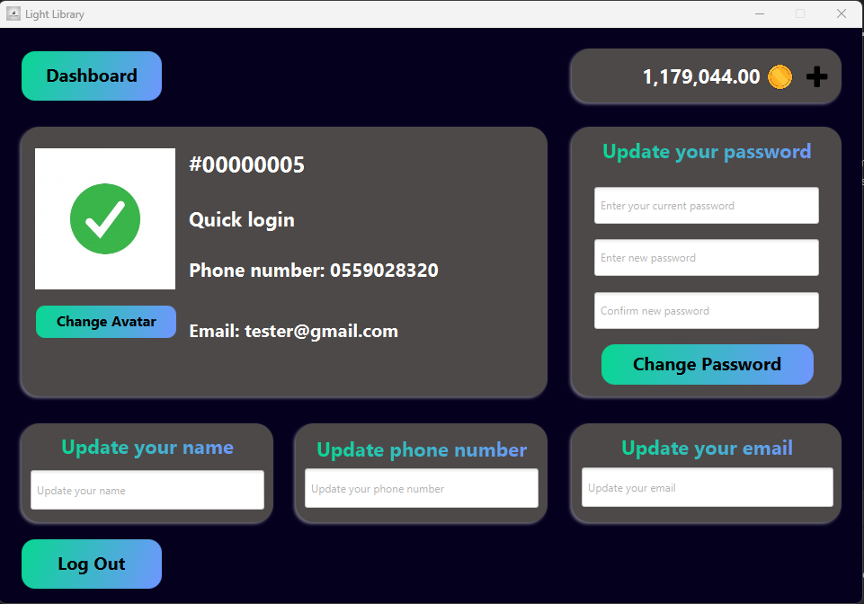
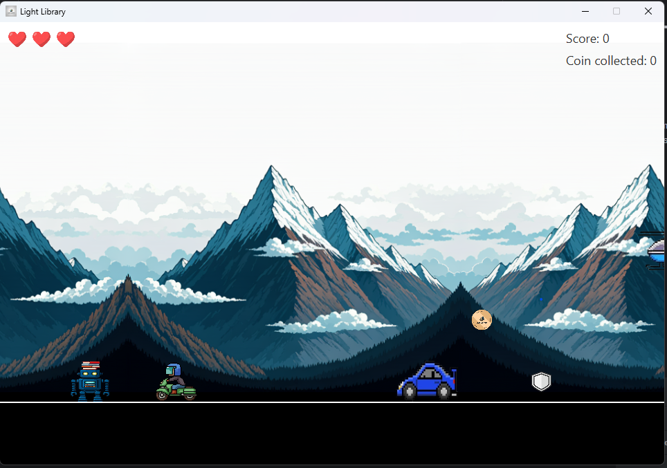

# Light Library - Library Management Application

## Description

This project is designed to support managing library system in easily way.
The application is written in Java and uses the JavaFX library, and it is based on MVC models.
This app has 2 role to access are Customer and Admin.

## Tech Stack

- Language: Java
- Database: MySQL Server
- Backend: JDBC, Gson, [Google Books API](https://developers.google.com/books)
- Frontend: JavaFX, JavaFX CSS
- Build tool: maven
- Design pattern: MVC Model, UML Diagram
- Operating system: Windows
- Source version control: Git

## Contributors:
### 1. Nguyen Tu Anh Tuan 23030570 [**TuTuanLyan**](https://github.com/TuTuanLyan/) - Team leader:

- Designed the UI and project structure.
- Developed controllers for pages and implemented inter-page communication.
- Handled multi-threading and created object models for the project.
- Implemented search APIs and database connections. 
### 2. Pham Huu Manh 23020548 [**maomaoisgoodcat3**](https://github.com/maomaoisgoodcat3)

- Focused on displaying and filtering data in the UI.
- Developed features for displaying library books and filtering based on various criteria.
- Handled SQL queries and ensured data integration with the UI.

### 3. Duong Nguyen Minh Duc 23020525 [**fyb174147**](https://github.com/fyb174147)
- Developed the customer game feature.
- Implemented the chat system for communication between users (both admin and customer).

## Implementations:
1. Clone the project from the repository.
2. Open the project in the IDE.
3. Download the [database test](https://github.com/TuTuanLyan/DataOOPLibraryProject/blob/master/LightLibraryData.sql) and run it in MySQL sever/ Workbench.  
4. Run the project.
- **Note: You should exchange to your API key by getting it for free on Google Book API.**

## UML Diagram

## Main Features

### 1. For Customers:
- **Search for a Book:** Easily find the books you're looking for.
- **Borrow and Return Books:** Manage your borrowing and returning directly from the app.
- **View Borrowing History:** Check your borrowing records at any time.
- **Private/Public Chat:** Communicate with other customers or administrators.
- **Play Games to Earn Coins:** Engage in fun gameplay to collect more LiLi coins.
- **Update Account Information:** Edit your profile, including name, avatar, email, and phone number.
- **Recharge Account Balance:** Add funds to your account to continue enjoying the library's services.

### 2. For Administrators:
- **Overview of Library Status:** Monitor the overall activity and health of the library.
- **Search for a Book:** Easily find the books you're looking for.
- **Add, Edit, or Delete Books:** Manage the library's collection with ease.
- **Manage Customer Accounts:** Oversee and update customer account details.
- **Private/Public Chat:** Interact with customers and other admins seamlessly.

### 3. Currency: LiLi Coin
- **Usage:** LiLi coins are required for borrowing books.
- **Exchange Rate:** 1 LiLi coin = 1 VND.
- **Earning Coins:** Recharge your account or play games to collect more coins.

### 4. Game: Books delivery
- **Introduction:** Mao the robot has a mission: transporting books to the LightLibrary warehouse. However, its AI system is currently malfunctioning, so it requires remote control to navigate. Can you help Mao dodge obstacles while it carries the books to the warehouse? If you're unsure how to control it, don't worry - it's as simple as playing Chrome Dino. Just keep in mind, Mao hasn't quite mastered the art of ducking! (Look at his head :v)
- **Objective:** Play, collect items, and earn LiLi coins to use in the library system.

### 5. Chat system
- **Connecting to chat server**
  + Ensure you're **connected to a server** before chatting.
  + Switch between servers by disconnecting, entering the desired server's IP address, and reconnecting.
- **Messaging Syntax:**
  + Use this syntax to send a message
    > @recipient message
  + For example, if you want to say **"hello"** to customer **"alice"**, just type
    > @alice hello
  + You can use **"@all", "@admin"** and **"@customer"** to send messages to **everyone, all administrators** and **all customers**. For example
    > @all hi everyone!
    > 
    > @admin I need help with this problem. Is there anyone can help me?
    > 
    > @customer This is a message to all customers.
  + **NOTE**: You **cannot** send messages to yourself or users not listed on the server.

## Some images about this project

- **Login and register page**

- **Administrator home**

- **Customer home**

- **A customer is searching for a book**

- **Dark mode**

- **Customer setting**

- **Game**

## Demo
[**Light library Video Demo**](https://drive.google.com/drive/u/0/folders/1RFtEOsOYPGNiwfleJi0zSwGxXiCB9uEY)

## Contributing
Pull requests are welcome. For major changes, please open an issue first to discuss what you would like to change.

## Project status
The project is completed.

## Notes
The application is written for educational purposes.